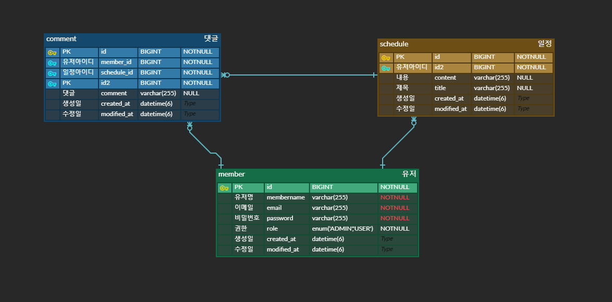

# 일정관리 앱 프로그램 Develope 레벨 (Schedule)

------------------------------------------------------------------------


## <span style="color: pink"> API 명세서
- ### [포스트맨 ScheduleProject API 명세서 (Click)](https://documenter.getpostman.com/view/23971624/2sAXxV5V3N)

## <span style="color: pink">  ERD 설계


## <span style="color: pink"> 개요 (Overview)
일정 관리 어플리케이션은 사용자가 일정을 등록, 수정, 삭제할 수 있으며, 등록된 일정을 조건별로 필터링하고 검색할 수 있는 기능을 제공합니다.


추가적으로 JWT 토큰 기반 인증 기능이 적용되어 회원가입, 로그인과 같은 사용자 인증 및 권한 관리 기능이 포함되었습니다. 사용자는 회원가입 후 로그인하여 JWT 토큰을 발급받고, 인증된 사용자만이 일정을 등록, 수정, 삭제할 수 있습니다. 또한, 관리자 권한이 있는 사용자는 일정 삭제 등의 추가 기능을 수행할 수 있습니다.

댓글 기능도 추가되어 각 일정에 대해 사용자가 댓글을 작성하고 수정할 수 있으며, 비밀번호로 보호된 댓글을 통해 작성자만 댓글을 관리할 수 있습니다. 이로 인해 사용자는 일정을 관리할 뿐만 아니라 각 일정에 대한 피드백 및 커뮤니케이션도 가능해졌습니다.

또한, 다른 유저를 일정에 배정하는 기능이 추가되었습니다. 일정 작성자는 일정을 함께 관리할 다른 사용자를 배정할 수 있으며, 배정된 유저들은 해당 일정에 대한 권한을 갖고 협력하여 일정을 관리할 수 있습니다. 이를 통해 팀이나 그룹 단위로 일정을 함께 관리할 수 있는 협업 기능이 강화되었습니다.
<br><br>
## <span style="color: pink"> 주요 기능 (Key Features)
### 1. `JWT 기반 인증` :
 - 회원가입: 사용자 계정을 생성하고 JWT 토큰 발급.
 - 로그인: 사용자 로그인 시 JWT 토큰 발급.
 - 권한 관리: JWT 토큰을 통해 인증된 사용자만 일정 관리 기능 사용 가능.
### 2. `일정 관리` :
 - 일정 등록, 수정, 삭제.
 - 작성자명, 수정일 조건으로 일정 조회.
 - ID로 특정 일정 단건 조회.
 - 다른 유저 배정: 일정 작성자는 다른 사용자를 일정에 배정할 수 있으며, 배정된 유저는 해당 일정 관리에 참여할 수 있음.
### 3. `댓글 기능` :
 - 각 일정에 댓글 작성, 수정, 삭제 가능.
 - 비밀번호로 보호된 댓글 관리.
<br><br>
## <span style="color: pink"> 기술 스택 (Tech Stack)
- #### **Java**: `Java 17`
- #### **Backend**: `Spring Boot`
- #### **Database**: `MySQL`
- #### **ORM** : `JPA`
- #### **Build Tool**: `Gradle`
- #### **Security** : `JWT`
<br><br>
## <span style="color: pink"> 개발자 가이드 (Developer Guide)
### 1. 환경 변수 설정
- MySQL 데이터베이스 연결을 위한 환경 변수를 설정해야 합니다. `application.properties` 파일에 다음 설정을 추가합니다 <br>
```properties
spring.datasource.url=jdbc:mysql://localhost:3307/{yourdatabase}
spring.datasource.username=root
spring.datasource.password={yourpassword}
spring.datasource.driver-class-name=com.mysql.cj.jdbc.Driver

spring.jpa.hibernate.ddl-auto=create

spring.jpa.properties.hibernate.show_sql=true
spring.jpa.properties.hibernate.format_sql=true
spring.jpa.properties.hibernate.use_sql_comments=true

jwt.secret.key=7Iqk7YyM66W07YOA7L2U65Sp7YG065+9U3ByaW5n6rCV7J2Y7Yqc7YSw7LWc7JuQ67mI7J6F64uI64ukLg==
```
### 2. Gradle 의존성 추가 ( Dependency Injection )
- `build.gradle` 파일에 필요한 라이브러리를 의존성 주입을 합니다.<br>
```build.gradle
dependencies {
    implementation 'org.springframework.boot:spring-boot-starter-validation'
    implementation 'org.springframework.boot:spring-boot-starter-security'
    implementation 'org.springframework.boot:spring-boot-starter-data-jpa'
    runtimeOnly 'com.mysql:mysql-connector-j'
    compileOnly group: 'io.jsonwebtoken', name: 'jjwt-api', version: '0.11.5'
    runtimeOnly group: 'io.jsonwebtoken', name: 'jjwt-impl', version: '0.11.5'
    runtimeOnly group: 'io.jsonwebtoken', name: 'jjwt-jackson', version: '0.11.5'
    implementation 'org.springframework.boot:spring-boot-starter-thymeleaf'
    implementation 'org.springframework.boot:spring-boot-starter-web'
    compileOnly 'org.projectlombok:lombok'
    annotationProcessor 'org.projectlombok:lombok'
    testImplementation 'org.springframework.boot:spring-boot-starter-test'
    testRuntimeOnly 'org.junit.platform:junit-platform-launcher'
}
```